# PhysioBot

AI-powered physiotherapy coaching PWA. Generates personalized training plans via Claude, coaches you through sessions with a voice coach, and adapts the plan based on your feedback over time.

---

## User Journey

```
Register → Personality Setup → Health Profile → Dashboard → Start Session → Feedback → Plan adapts
```

1. **Sign up** with email + password
2. **Personality onboarding** — choose what drives you, how your coach should talk to you, and pick a coach persona
3. **Health profile** — describe your complaints, goals, and fitness level; set session duration and weekly frequency
4. **Claude generates a plan** automatically on first login — warm-up / main / cool-down, tailored to your profile
5. **Train** — guided exercise-by-exercise with voice coaching and a countdown timer or rep counter
6. **Rate each exercise** — too easy / just right / too hard / painful
7. **Claude adapts** — the plan is updated after each session based on your ratings and pain history

---

## Features

### Personalized Onboarding

Four-step wizard that shapes everything the AI coach does:

| Step | Options |
|------|---------|
| **What drives you?** | Goals & milestones / Pain-free living / Both |
| **Coaching style** | Energetic 🔥 / Direct & demanding ⚡ / Gentle & encouraging 🌿 |
| **Coach persona** | The Energizer 🚀 (Tony Robbins energy) / The Calm One 🧘 / The Drill Sergeant 🎖️ |
| **Language** | Deutsch 🇩🇪 / English 🇬🇧 |

### Health Profile

Before the first plan is generated, users define:
- **Complaints** — e.g. neck pain, lower back, shoulder
- **Goals** — free text (mobility, strength, pain reduction …)
- **Fitness level** — Beginner / Intermediate / Advanced
- **Session duration** — 10–60 minutes
- **Sessions per week** — 1–7

### AI Plan Generation

Claude (`claude-haiku-4-5`) generates a structured plan with three phases:

| Phase | XP | Content |
|-------|----|---------|
| 🔥 Warm-up | 10 XP/exercise | Mobility and activation |
| ⚡ Main | 20 XP/exercise | Targeted therapeutic exercises |
| 🌿 Cool-down | 10 XP/exercise | Stretching and recovery |

Each exercise includes a name, description, duration or rep/set scheme, and a `voice_script` read aloud by the coach.

### Voice Coaching

Two providers, switchable via environment variable:

| Provider | Quality | Cost |
|----------|---------|------|
| Browser Web Speech API | Good | Free |
| ElevenLabs | High quality, natural | Paid API |

The coach reads the voice script for each exercise, counts reps, and provides phase transitions.

### Active Session Player

Full-screen training experience:
- Exercise-by-exercise progression with animated transitions
- **Timed exercises** — countdown timer with progress ring
- **Rep exercises** — tap-to-complete rep counter
- Voice script plays automatically at exercise start
- Skip or pause at any point

### Post-Session Feedback

After every session, rate each exercise individually:

- **Too easy** — plan gets harder next time
- **Just right** — no change
- **Too hard** — load or duration reduced
- **Painful** ⚠️ — exercise flagged, Claude replaces or modifies it

Feedback is sent to Claude with the user's pain history (via Mem0) and generates an updated plan automatically.

### Gamification

Completing sessions earns XP and unlocks levels and badges:

**Levels** (6 total):

| Level | XP range | Title |
|-------|----------|-------|
| 1 | 0–200 | Bewegungsstarter |
| 2 | 200–400 | Körperbewusst |
| 3 | 400–650 | Ausdauernder |
| 4 | 650–1000 | Bewegungstalent |
| 5 | 1000–1500 | Körpermeister |
| 6 | 1500+ | Physio-Champion |

**Badges** (8 total):

| Badge | Condition |
|-------|-----------|
| 🔥 Erster Schritt | Complete first session |
| 💪 7-Tage-Held | 7-day streak |
| 🎯 Nacken-Profi | 10× neck plan |
| 🏆 Körpermeister | Reach Level 5 |
| ⚡ Energiequelle | 1000 XP total |
| 🌙 Morgenmensch | 7 sessions before 9 AM |
| 🔄 Comeback-Kid | Return after a break |
| 💎 Monats-Profi | 30-day streak |

**Streaks** — daily training streak tracked with freeze days to handle recovery days.

### Training Schedule & Reminders

In Settings, users configure:
- Which weekdays they train (e.g. Mo / Mi / Fr)
- The session start time
- Timezone

The dashboard shows the weekly plan as a visual day strip (planned / completed / missed). If notification permission is granted, a browser push notification fires 5 minutes before the configured session time.

### Physio Professional Integration

A physio therapist can be linked to a patient account:
- Plans created by a physio are labeled **Physio** (vs. **AI**)
- The patient's settings page shows the assigned physio's name and address
- The physio's plan takes precedence and is not overwritten by AI feedback

### Progressive Memory (Mem0)

Pain feedback, preferences, and coach interactions are stored in Mem0 across sessions. Claude receives this context when generating or adapting plans, so the coach remembers that you've had shoulder pain for three weeks or that you prefer shorter warm-ups.

### PWA

Installable as a home screen app on iOS (Safari → Add to Home Screen) and Android. Runs full-screen without browser chrome.

---

## Screenshots

### Dashboard

| Desktop | Mobile |
|---------|--------|
| 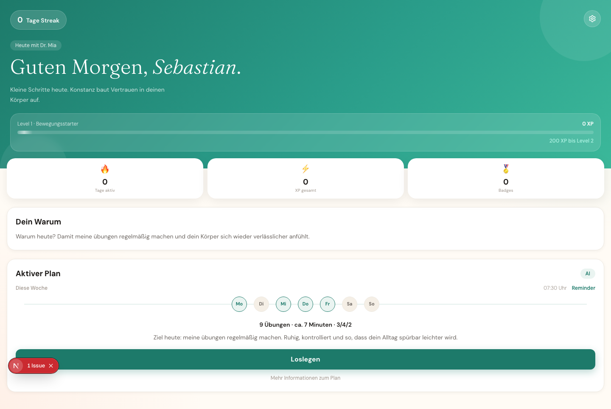 | 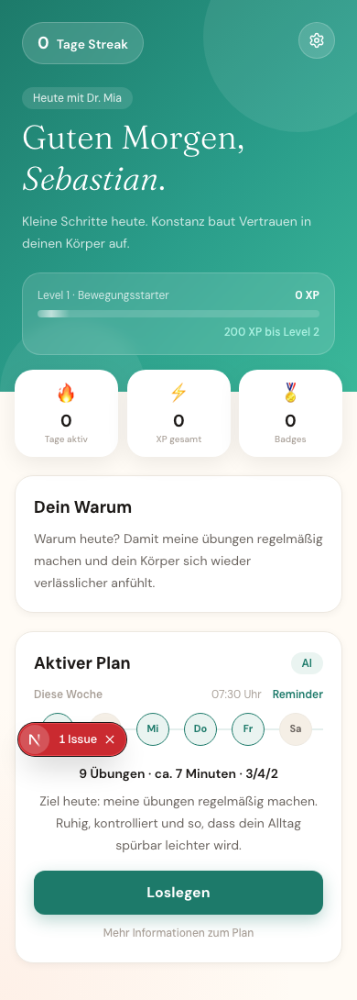 |

### Plan Detail

| Desktop | Mobile |
|---------|--------|
| 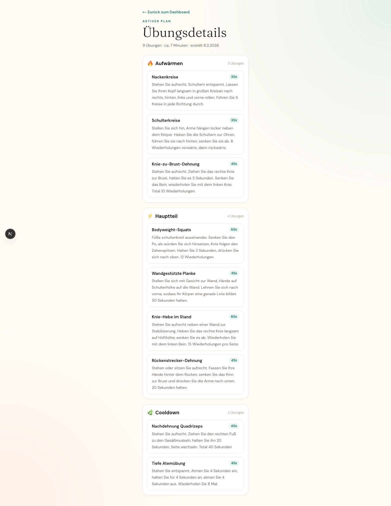 | 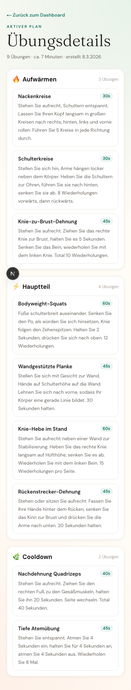 |

### Training Session

| Desktop | Mobile |
|---------|--------|
| 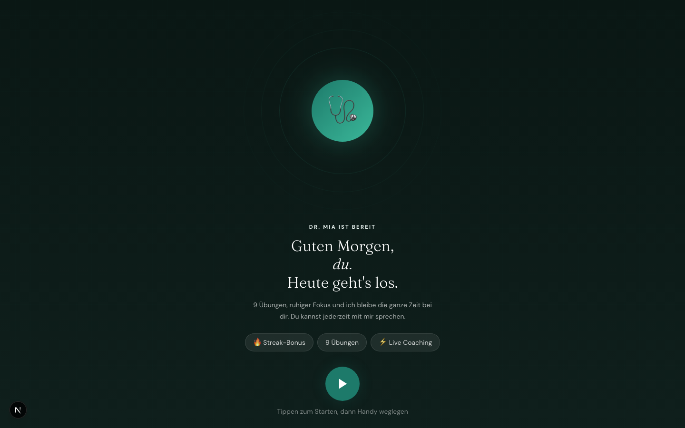 | 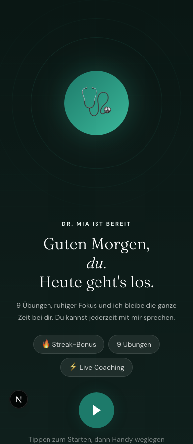 |

### Post-Session Feedback

| Desktop | Mobile |
|---------|--------|
| 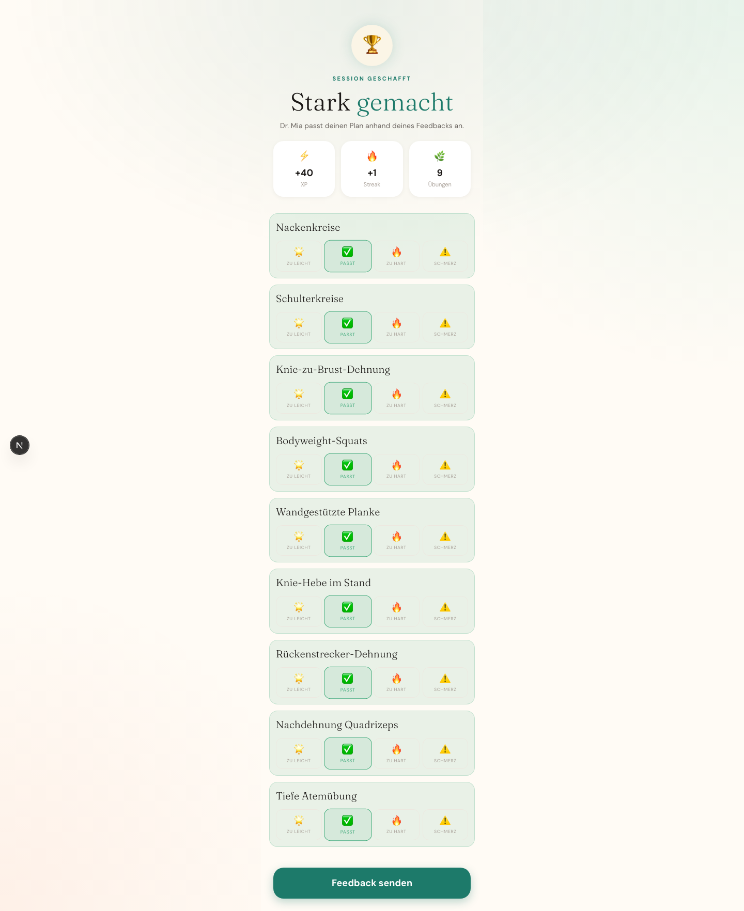 | 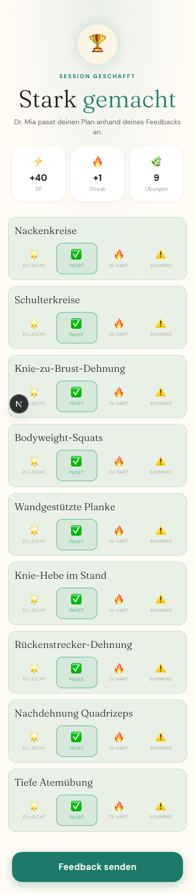 |

### Onboarding

| Personality | Health Profile |
|-------------|----------------|
| 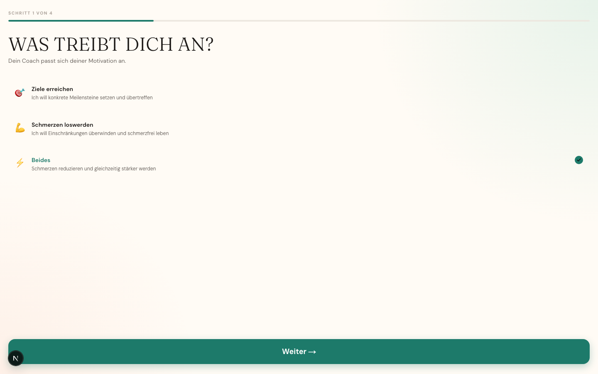 | 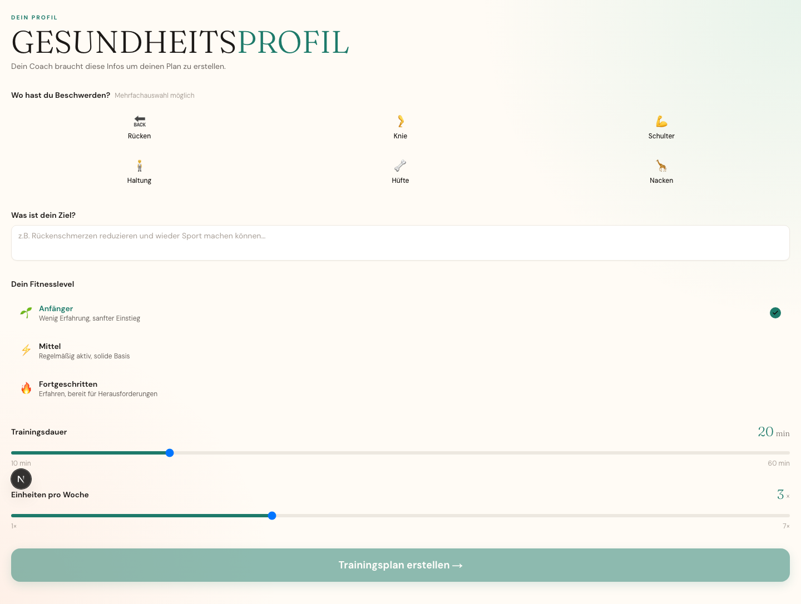 |

### Settings

| Desktop | Mobile |
|---------|--------|
| 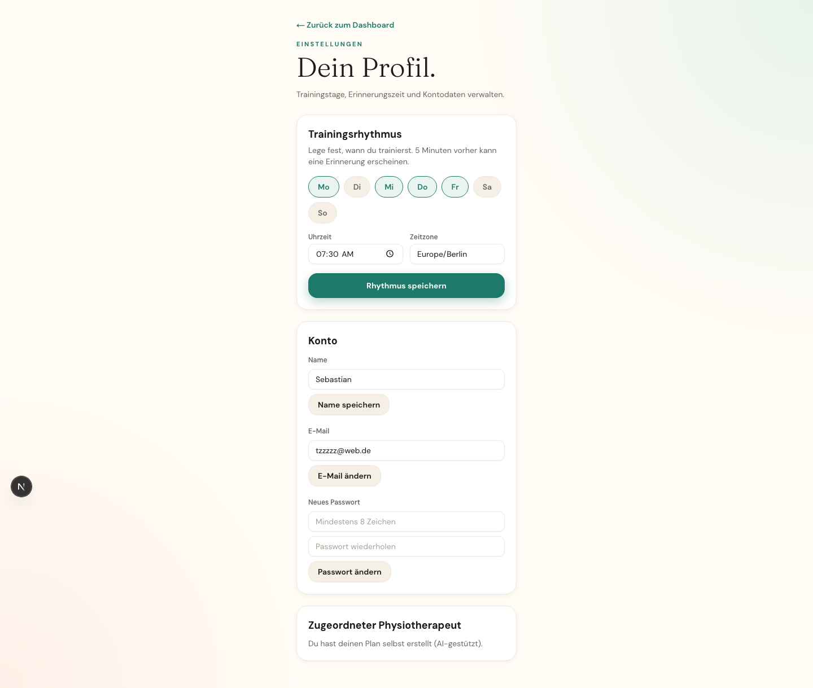 | 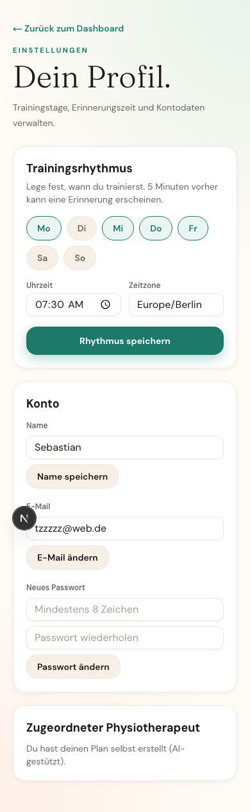 |

---

## Tech Stack

| Layer | Technology |
|-------|-----------|
| Frontend | Next.js 16 (App Router), TypeScript, Tailwind CSS v4, shadcn/ui |
| Auth & DB | Supabase (PostgreSQL, EU region Frankfurt) |
| AI | Claude API (`claude-haiku-4-5`) |
| Memory | Mem0 (progressive user memory across sessions) |
| Voice | Browser Web Speech API / ElevenLabs (switchable via env var) |
| Hosting | Vercel |

---

## Getting Started

### Prerequisites

- Node.js 18+
- [Supabase](https://supabase.com) project (EU region recommended)
- [Anthropic API key](https://console.anthropic.com)
- Optional: [ElevenLabs API key](https://elevenlabs.io), [Mem0 API key](https://mem0.ai)

### Setup

```bash
npm install
cp .env.example .env.local
```

Fill in `.env.local`:

```env
NEXT_PUBLIC_SUPABASE_URL=https://your-project.supabase.co
NEXT_PUBLIC_SUPABASE_ANON_KEY=your-anon-key
ANTHROPIC_API_KEY=sk-ant-...
NEXT_PUBLIC_VOICE_PROVIDER=browser   # or: elevenlabs
ELEVENLABS_API_KEY=                  # only needed for elevenlabs
ELEVENLABS_VOICE_ID=                 # optional, defaults to Adam
MEM0_API_KEY=                        # optional, memory disabled without it
```

### Database

Run the migration in Supabase Dashboard → SQL Editor:

```bash
cat supabase/migrations/001_initial_schema.sql
```

### Run

```bash
npm run dev
```

Open [http://localhost:3000](http://localhost:3000).

---

## Project Structure

```
app/
  api/
    generate-plan/    # POST — generates AI training plan
    feedback/         # POST — saves feedback, adjusts plan
    voice/            # POST — ElevenLabs TTS proxy
  auth/               # Login / register / OAuth callback
  dashboard/          # Main dashboard: plan card, streak, XP, week strip
  onboarding/
    personality/      # Step 1: motivation style, coach persona, language
    health-profile/   # Step 2: complaints, goals, fitness level, duration
  plan/               # Full exercise list with phases
  settings/           # Schedule, account, physio assignment
  training/
    session/          # Active training session (full-screen)
    feedback/         # Post-session difficulty rating per exercise

components/
  auth/               # AuthForm, LoginPageClient, RegisterPageClient
  layout/             # AppShell (bottom navigation)
  training/           # PlanOverview, SessionPlayer

lib/
  claude/             # Anthropic client + prompt builders
  supabase/           # Browser + server clients
  voice/              # VoiceProvider abstraction (browser / ElevenLabs)
  mem0.ts             # Mem0 memory wrapper
  types.ts            # Shared TypeScript types (Exercise, Plan, Streak, Badge …)

scripts/
  screenshots.mjs     # Playwright screenshot script (all screens, desktop + mobile)
```

---

## Testing

```bash
npm run test:run     # run once
npm run test         # watch mode
```

23 tests across 8 files covering: auth forms, Claude prompt builders, voice provider factory, training plan overview, session player, Mem0 wrapper, feedback prompts.

---

## Design System

"Vital Dark" — deep warm charcoal with teal and amber accents:

| Token | Value |
|-------|-------|
| Background | `#0D0B09` |
| Primary (amber) | `#F0A04B` |
| Teal accent | `#2A9D8A` |
| Display font | Bebas Neue |
| Body font | Plus Jakarta Sans |

---

## Roadmap

- [ ] Physio professional dashboard — assign and monitor patients
- [ ] Knowledge RAG — physio domain expertise injected into system prompt
- [ ] AWS Bedrock EU — GDPR-compliant LLM processing
- [ ] Real app icons (currently placeholder)
- [ ] Streak freeze / recovery day handling
- [ ] Export training history as PDF
