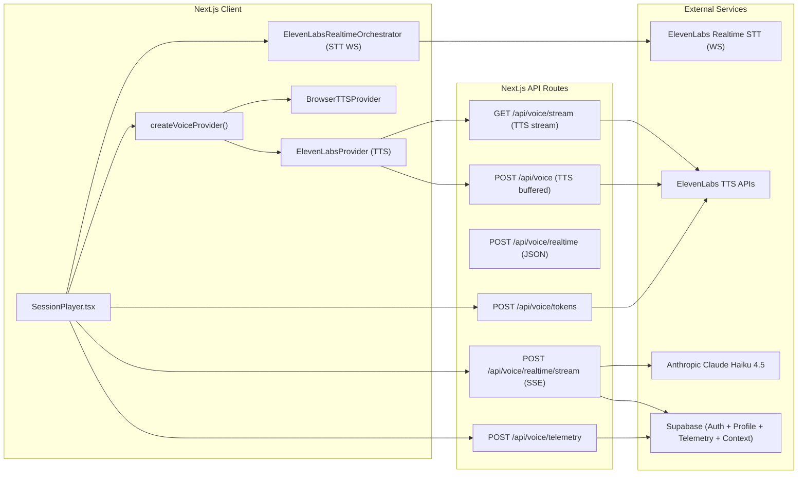
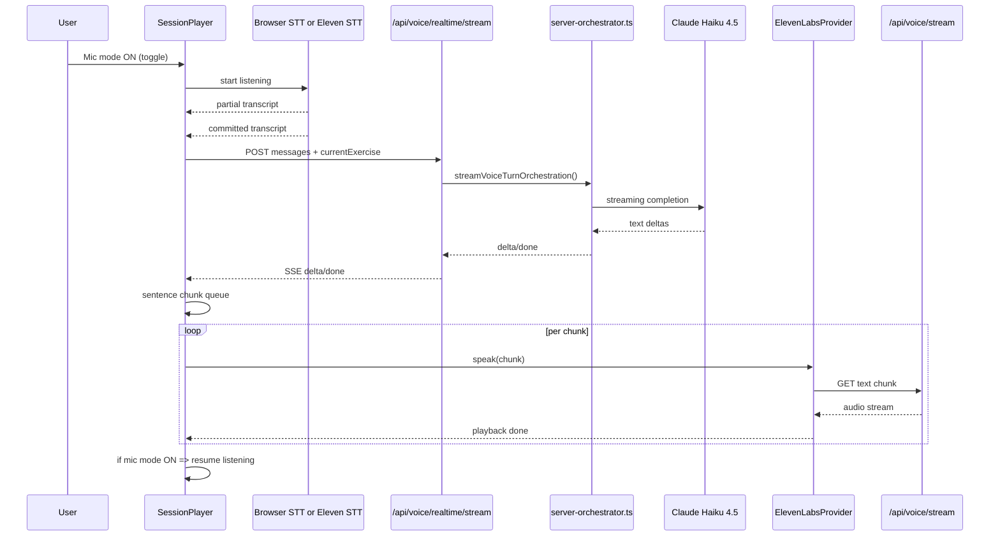
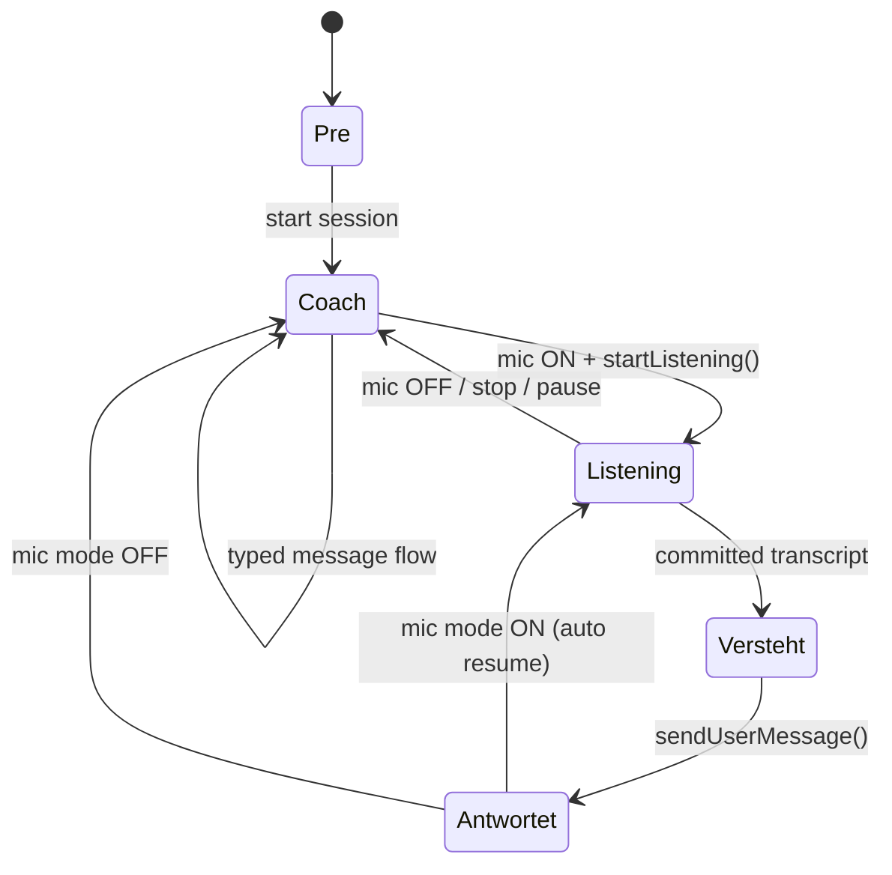
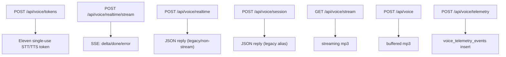
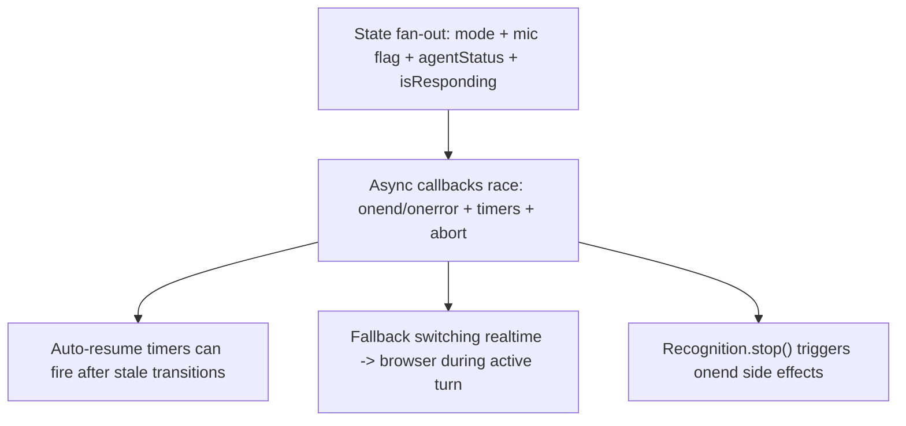

# Voice Mode - Current Architecture (Ist-Stand)

Date: 2026-03-10  
Purpose: Short map of what is currently built, so we can discuss targeted changes.

## 1) System map

## 2) Voice turn (runtime)

## 3) Frontend state model (current)

Notes:
- UI rendering is currently not only `mode`, but combined from:
  - `mode` (`pre|coach|listening`)
  - `isMicModeEnabled`
  - `agentStatus` (`hoert_zu|versteht|antwortet|bereit`)
  - `isResponding`

## 4) API landscape

## 5) Current model/provider choices
- LLM for voice replies: `claude-haiku-4-5-20251001`
- STT realtime: ElevenLabs `scribe_v2_realtime` (WebSocket, VAD commit)
- TTS primary: ElevenLabs (`/api/voice/stream`)
- TTS fallback: browser `speechSynthesis`
- Provider switch (client): `NEXT_PUBLIC_VOICE_PROVIDER` (`elevenlabs` or `browser`)

## 6) Known instability hotspots (important for next fixes)

Interpretation:
- We currently have a working but complex state machine spread across UI and async callbacks.
- Next stabilization should reduce states and centralize transitions into one explicit voice session state machine.
