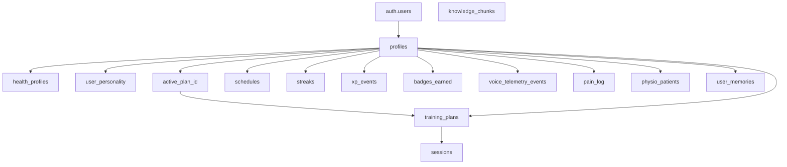

# Data Model and Storage

Purpose: Map the main data entities, storage boundaries, and ownership model across Supabase and external systems.

## Summary

Supabase is the main system of record for PhysioBot. It stores product state, session history, schedules, telemetry, and privacy-relevant records.

External systems add specialized capabilities:

- Mem0 for coaching memory
- Claude for inference
- ElevenLabs for speech services

## Entity Map

## Core Product Entities

| Entity | Purpose |
| --- | --- |
| `profiles` | root user record, role, active plan pointer, privacy consent |
| `health_profiles` | complaints, goals, fitness level, session preferences |
| `user_personality` | coach style, persona, language |
| `training_plans` | versioned plan records, exercises JSON, source, physio metadata |
| `sessions` | workout session history linked to a specific plan |
| `schedules` | training days, reminder time, timezone |
| `streaks`, `xp_events`, `badges_earned` | gamification state |
| `voice_telemetry_events` | runtime telemetry and privacy-audit style events |
| `pain_log` | physio-sensitive pain reports |
| `physio_patients` | therapist-patient assignment mapping |

## Storage Boundaries

| Store | Role |
| --- | --- |
| Supabase Postgres | source of truth for app state and compliance-relevant records |
| Mem0 | external memory layer for coaching context |
| `user_memories` table | present in schema but not the primary runtime memory path today |
| `knowledge_chunks` table | present in schema for future RAG, currently inactive |

## Design Characteristics

- plans are stored as JSON exercises inside `training_plans`, not as a deeply normalized exercise model
- the current plan is a pointer on `profiles`, which makes plan switching simple and history append-only
- a session links to the plan that was active when the session started
- a new auth user automatically gets a `profiles` row through a database trigger

## Access Model

The main product tables enable row-level security. The intent is simple ownership:

- users manage their own profile, onboarding, sessions, and schedules
- users read or insert their own plans
- users read their own telemetry and pain history
- physio-patient mapping controls access to assigned therapist profile data

## Related Documents

- [Training Plan Lifecycle](training-plan-lifecycle.md)
- [Privacy and Data Handling](privacy-and-data-handling.md)
- [Physio Mode and Safety](physio-mode-and-safety.md)
