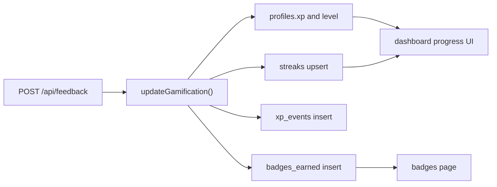

# Gamification

Purpose: Describe how XP, streaks, and badges are calculated and updated.

## Summary

Gamification updates are triggered when feedback is submitted after a session. The current implementation calculates XP from completed exercises, updates streak state, records XP events, and awards a subset of defined badges.

## Update Flow

## Current Scoring Rules

| Rule | Current behavior |
| --- | --- |
| Warmup exercise | `10 XP` |
| Main exercise | `20 XP` |
| Cooldown exercise | `10 XP` |
| Session bonus | `+20 XP` |
| Streak bonus | `+20%` of base phase XP when streak is active |

## Streak Logic

- if the last session was today, the streak stays unchanged
- if the last session was yesterday, the streak increments
- otherwise the streak resets to `1`

## Current Badge Automation

The implemented award logic currently covers:

- `first_step`
- `week_hero`
- `month_pro`
- `energy_source`
- `body_master`

Important current-state note:

- the badge catalog contains additional badges, but not all of them are currently awarded by `updateGamification()`

## Where the State Lives

- current XP and level: `profiles`
- streak counters: `streaks`
- XP history: `xp_events`
- earned badges: `badges_earned`

## Related Documents

- [Training Plan Lifecycle](training-plan-lifecycle.md)
- [Data Model and Storage](data-model-and-storage.md)
