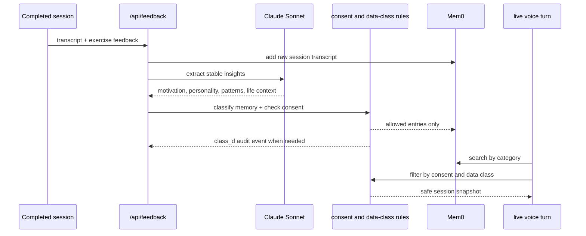

# Memory Architecture

Purpose: Explain how PhysioBot turns session conversations into reusable coaching context.

## Summary

PhysioBot uses Mem0 as an external memory layer, but it does not store everything in the same way.

There are three distinct memory paths:

- simple retrieval for plan generation and plan adaptation
- transcript storage for completed sessions
- structured insight extraction for live coaching context

## Memory Flow

## Memory Categories

| Category | Meaning |
| --- | --- |
| `motivation_hints` | durable reasons the user cares about training |
| `personality_preferences` | preferred communication style and encouragement style |
| `training_patterns` | pain points, preferred exercises, fatigue signals |
| `life_context` | stable job, family, or routine context that changes coaching tone |

## Two Retrieval Styles

| Usage | Mechanism |
| --- | --- |
| Plan generation and adaptation | lightweight `getRelevantMemories()` search by query |
| Live voice coaching | `MemoryResolver` builds a structured snapshot per session |

## Current Rules

- extracted memories are meant to be stable patterns, not a transcript archive
- memory storage is gated by privacy consent and data class
- medical-rehab memory reads and writes are audited
- retrieval is filtered again at read time, not only at write time
- the live resolver caches snapshots per `userId`, `sessionCount`, and consent level

## Operational Notes

- Mem0 failures are handled as graceful degradation in the main plan and feedback flows
- the database schema still contains `user_memories`, but current runtime memory work is centered on Mem0
- the knowledge RAG path is separate from user memory and currently inactive

## Related Documents

- [Privacy and Data Handling](privacy-and-data-handling.md)
- [Training Plan Lifecycle](training-plan-lifecycle.md)
- [Data Model and Storage](data-model-and-storage.md)
- [ADR-0004 Derived Coaching Memory](../adr/ADR-0004-derived-coaching-memory.md)
