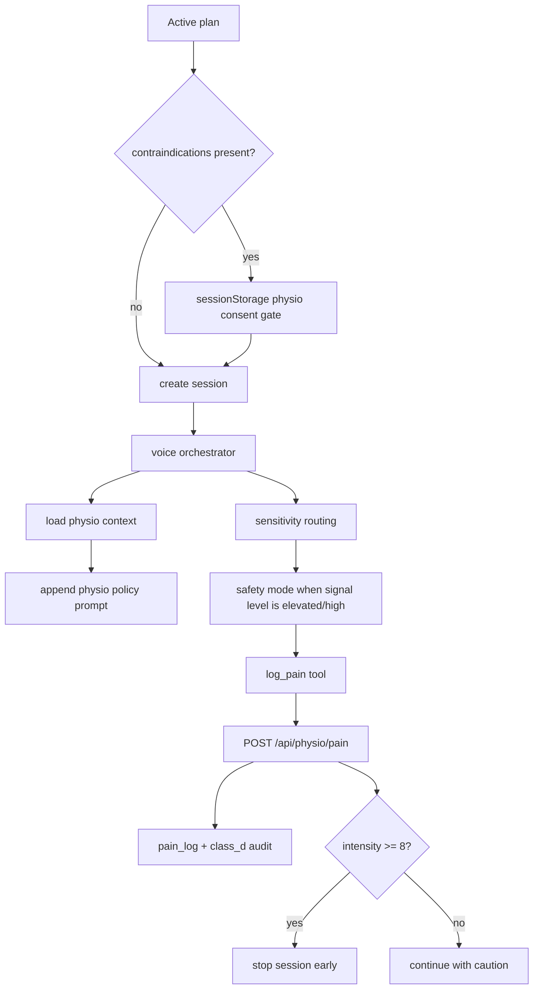

# Physio Mode and Safety

Purpose: Describe how physio-authored context, consent, pain handling, and safety rules shape the live coaching experience.

## Summary

Physio mode adds therapist-authored boundaries on top of the normal AI coaching flow.

The system can incorporate:

- contraindications
- therapist notes
- exercise-specific modifications
- mobility baselines
- recent pain reports

## Safety Flow

## Sources of Physio Context

| Source | Purpose |
| --- | --- |
| `training_plans.contraindications` | hard boundaries that must not be crossed |
| `training_plans.therapist_notes` | therapist-authored context for coaching |
| `training_plans.exercise_modifications` | approved substitutions or modifications |
| `training_plans.mobility_baseline` | baseline rehab context |
| `pain_log` | recent symptom history for safety-sensitive coaching |

## Core Safety Rules

- the coach must not diagnose
- the coach must not deviate from the therapy plan
- pain intensity `>= 8` triggers immediate stop guidance
- serious complaints should redirect the user to the therapist
- pain descriptions should be recorded through `log_pain`

## Consent Boundary

Current implementation behavior:

- the session-start consent gate is triggered from `requiresPhysioConsent(plan)`
- that check currently uses the presence of plan contraindications as the entry condition
- acceptance is stored in `sessionStorage` and scoped to the current `planId`

That means physio consent is currently a client-side session convenience, not a durable server-side consent record.

## Sensitivity Routing

The voice system also classifies sensitive or medical language during a live turn.

- elevated or high-sensitivity utterances push the coach into a safer response pattern
- some tools are blocked at high sensitivity
- the physio prompt and sensitivity prompt can both apply to the same turn

## Related Documents

- [Training Plan Lifecycle](training-plan-lifecycle.md)
- [Voice Mode - Current Architecture](2026-03-10-voice-mode-current-architecture.md)
- [Voice Tool Execution](voice-tool-execution.md)
- [ADR-0003 Physio Safety Boundaries](../adr/ADR-0003-physio-safety-boundaries.md)
