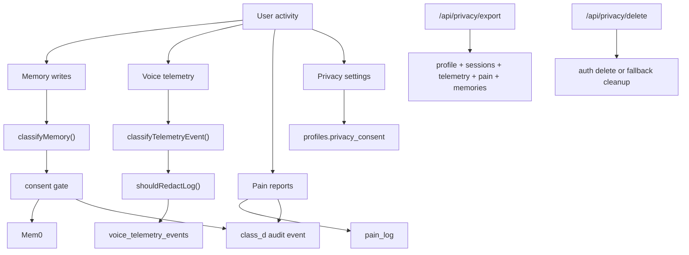

# Privacy and Data Handling

Purpose: Explain how PhysioBot classifies, stores, redacts, exports, and deletes user data.

## Summary

Privacy behavior is built around two control layers:

- a consent model: `full`, `minimal`, `none`
- a data classification model: `A`, `B`, `C`, `D`

These rules influence memory storage, memory retrieval, telemetry redaction, and audit logging.

## Data Classes

| Class | Meaning | Typical usage | Current retention |
| --- | --- | --- | --- |
| `A` | Operational | runtime telemetry, technical events | 90 days |
| `B` | Personal coaching | coaching preferences, training patterns | no automatic expiry |
| `C` | Sensitive wellness | life context, motivation, wellness context | no automatic expiry |
| `D` | Medical rehab | pain reports, diagnosis-adjacent rehab signals | no automatic expiry |

## Consent Levels

| Consent | Effect |
| --- | --- |
| `full` | personal memory and medical-rehab memory can be stored and retrieved |
| `minimal` | no personal or medical memory retrieval; operational telemetry remains |
| `none` | no new memory storage; operational telemetry remains |

## Data Flow

## Current Behaviors

- Non-operational telemetry payloads are redacted before insertion.
- Personal and medical memory storage requires `full` consent.
- Personal and medical memory retrieval also requires `full` consent.
- Class `D` reads and writes generate audit-style events in `voice_telemetry_events`.
- Operational telemetry is the only class with an implemented automatic retention window.

## Export Behavior

The export endpoint currently bundles:

- profile
- health profile
- personality
- schedule
- sessions
- telemetry
- pain log
- Mem0 memories

Current implementation note:

- The export is not a full database dump. It does not currently include all product-side records such as every training plan version, XP event, or badge record.

## Delete Behavior

Account deletion follows two paths:

- preferred path: delete the auth user with a service-role admin client
- fallback path: delete a narrower set of user data tables and reset selected profile fields

Current implementation note:

- The fallback cleanup is narrower than deleting the auth user and relies on explicit table cleanup plus profile reset.

## Recommended Reader Mental Model

- Supabase is the product system of record.
- Mem0 is an auxiliary memory system controlled by privacy rules.
- `voice_telemetry_events` is both an observability table and a privacy-audit surface for class `D` events.

## Related Documents

- [Data Model and Storage](data-model-and-storage.md)
- [Memory Architecture](memory-architecture.md)
- [Voice Telemetry and Observability](voice-telemetry-and-observability.md)
- [ADR-0002 Privacy Consent and Data Classification](../adr/ADR-0002-privacy-consent-and-data-classification.md)
