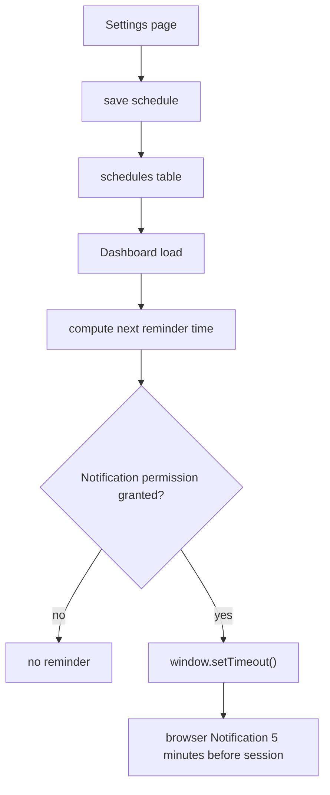

# Scheduling and Reminders

Purpose: Explain how PhysioBot stores training rhythm and how reminders are currently triggered.

## Summary

Scheduling has two layers:

- persistent schedule preferences in Supabase
- reminder execution in the browser client

The current implementation is intentionally simple and local to the active browser session.

## Reminder Flow

## Stored Schedule Data

| Field | Meaning |
| --- | --- |
| `days` | weekday numbers for planned training |
| `notify_time` | preferred local training time |
| `timezone` | user-selected timezone label |

## Current Behavior

- users can choose days, reminder time, and timezone in settings
- the dashboard computes the next reminder from that schedule
- if permission is granted, the app schedules a browser notification five minutes before the session

## Important Current-State Notes

- Reminder scheduling currently runs in the dashboard client through `window.setTimeout()`.
- That means reminders depend on the browser session being open and alive.
- The current code path is not a service-worker push notification system.
- The schedule record stores a timezone, but the dashboard reminder calculation currently uses browser-local `Date` logic and does not perform explicit timezone conversion.

## Architecture Implication

For now, scheduling is a product preference model with a local reminder helper, not a background notification platform.

## Related Documents

- [Data Model and Storage](data-model-and-storage.md)
- [System Overview](system-overview.md)
