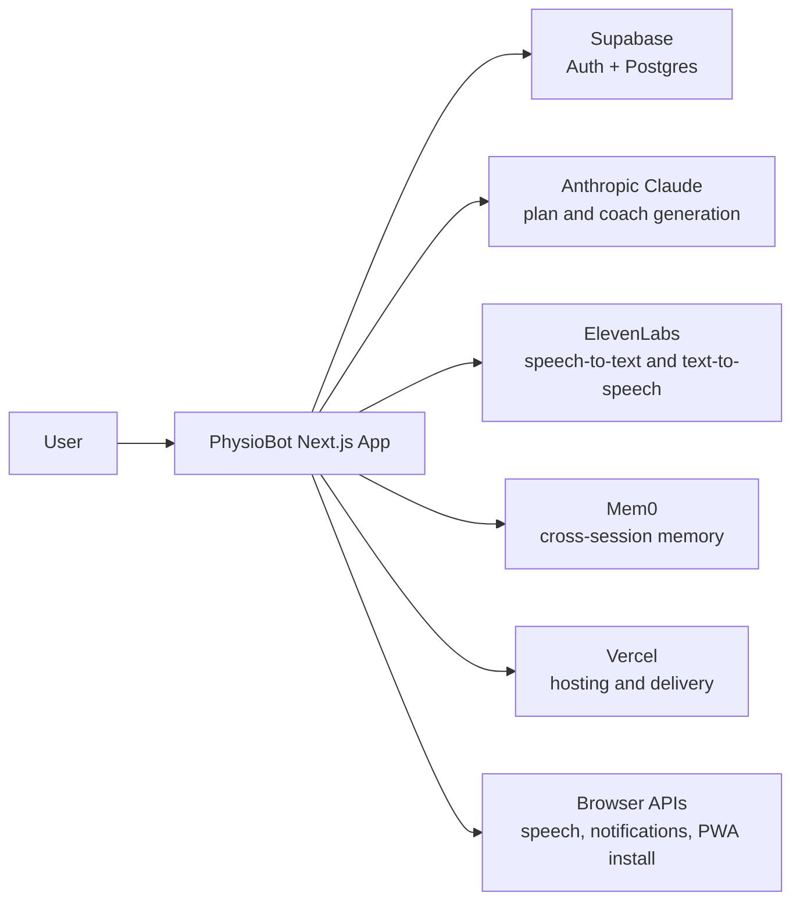

# System Overview

Purpose: Provide a product-level map of the PhysioBot system, the main responsibilities inside it, and the external services it depends on.

## Summary

PhysioBot is currently deployed as a single Next.js application that combines:

- the user-facing product experience
- server-rendered and API route logic
- orchestration for AI and voice features
- integrations with external platform services

The product is not structured as many separately deployed internal services. Instead, one application coordinates several external providers.

## System Context

## Core Responsibilities

| Area | Responsibility |
| --- | --- |
| Next.js app | UI, onboarding, training flows, settings, and API routes |
| Supabase | Authentication, relational data, telemetry, privacy-related records |
| Claude | Plan generation, plan adaptation, and voice coach responses |
| ElevenLabs | Higher-quality speech recognition and voice playback |
| Browser APIs | Free speech fallback, push notifications, PWA behavior |
| Mem0 | Cross-session user memory where enabled |
| Vercel | Hosting and runtime delivery |

## Main Product Flows

### Plan Creation and Adaptation

1. The user completes onboarding and health profile data.
2. The app sends profile context to Claude.
3. Claude returns a structured training plan.
4. Feedback after sessions is used to adapt the plan over time.

### Voice Coaching

1. The user starts a guided session.
2. The app captures spoken input through browser speech or ElevenLabs.
3. The server orchestrates the voice turn and requests a response from Claude.
4. The answer is spoken back through ElevenLabs or browser speech.

### Privacy and Memory

1. Sensitive health and coaching context is classified and stored through the app's privacy and persistence layers.
2. Memory and retention rules determine what is kept, exported, or deleted.

## Important Boundaries

- The app owns product logic and orchestration.
- External AI and voice providers perform inference and speech processing.
- Supabase is the system of record for application data.
- Memory is an auxiliary capability, not the core source of truth.

## Related Documents

- [Voice Mode - Current Architecture](2026-03-10-voice-mode-current-architecture.md)
- [ADR Index](../adr/index.md)
