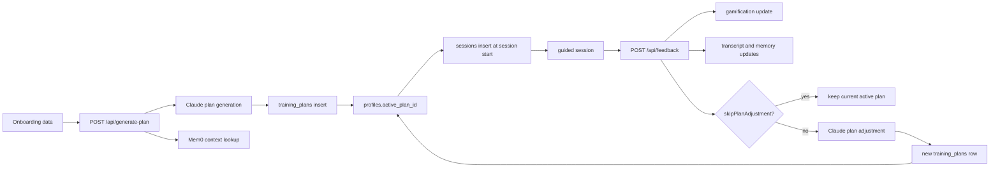

# Training Plan Lifecycle

Purpose: Explain how PhysioBot creates, activates, updates, and tracks training plans over time.

## Summary

PhysioBot treats a plan as a versioned record, not a mutable document.

- a new plan is inserted into `training_plans`
- `profiles.active_plan_id` points to the current plan
- each session stores the `plan_id` that was active when the session started
- post-session feedback can create the next AI-generated plan version

## Lifecycle View

## Main Responsibilities

| Stage | What happens |
| --- | --- |
| Onboarding | Personality and health profile are collected and stored |
| Initial generation | Claude creates the first plan using onboarding data and relevant memories |
| Activation | The new plan becomes current through `profiles.active_plan_id` |
| Session start | A `sessions` row is created and linked to the active plan |
| Feedback | Session completion updates the session record, gamification, and optional memory extraction |
| Adaptation | If adjustment is not skipped, feedback is sent back to Claude and a new plan version is inserted |

## Current Implementation Rules

- Plan generation requires both `user_personality` and `health_profiles`.
- The dashboard generates a plan when the user has no active plan.
- Plan history is append-only: plan updates create new rows instead of overwriting existing rows.
- `sessions.plan_id` preserves the plan snapshot used for a specific workout session.
- Feedback can explicitly skip plan adjustment while still allowing session completion and gamification updates.

## Important Current-State Notes

- The active-plan switch happens through `profiles.active_plan_id`, not by mutating the current plan row.
- The feedback route currently decides whether to adjust the plan from the `skipPlanAdjustment` flag. It does not branch on plan `source`.
- The settings and profile views already distinguish between `ai` and `physio` plan sources, so plan ownership is visible even though plan activation is still a single-pointer model.

## Related Documents

- [System Overview](system-overview.md)
- [Data Model and Storage](data-model-and-storage.md)
- [Gamification](gamification.md)
- [Physio Mode and Safety](physio-mode-and-safety.md)
