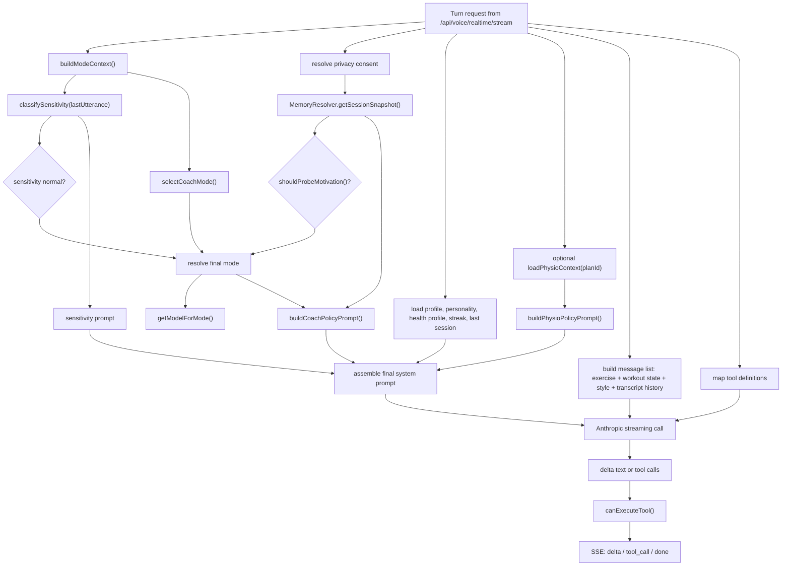

# Voice Orchestration

Purpose: Explain how PhysioBot builds a live coaching turn from multiple decision layers instead of using a single static prompt path.

## Summary

Voice orchestration is one of the more complex parts of the system.

A live turn is assembled from:

- workout context
- recent conversation history
- structured memory
- user personality and language
- physio-specific safety context
- sensitivity classification
- coaching mode selection
- tool definitions and tool gating

This means the runtime behavior is not just "send transcript to one prompt and return text".

## Orchestration Flow

## Plain-Language View

When the user says something during a session, the system does not immediately ask one model for one answer.

Instead it works more like this:

1. Figure out what kind of moment this is.
2. Pull in the right user context and safety context.
3. Decide which coach mode and model should handle the turn.
4. Build the prompt and tool set for that exact situation.
5. Stream back text and, if needed, tool calls.

That is why the orchestration layer exists.

## Worked Example 1: Normal Coaching Turn

Scenario:

- the user is in the main phase of an active exercise
- there is no pain or medical warning in the last utterance
- the user says: "Zaehl bitte fuer mich mit."

Step by step:

| Step | What the orchestrator does |
| --- | --- |
| Workout context | sees `exerciseStatus=active` and `phase=main` |
| Base mode | selects `performance` |
| Sensitivity check | finds no strong medical signal, so there is no safety override |
| Memory load | pulls coaching context such as preferred communication style |
| Model choice | keeps the turn on Haiku because this is a short performance cue |
| Prompt build | combines the Dr. Mia base prompt, the performance policy, memory hints, current exercise info, and recent transcript |
| Tools | workout tools are available if needed, but the model may not use any |
| Output | returns a short coaching reply such as a count cue or tempo reminder |

What the user experiences:

- a short response
- focused on the current movement
- no long explanation
- no heavy safety language

## Worked Example 2: Pain and Safety Turn

Scenario:

- the user is on a physio plan
- the plan contains contraindications and therapist notes
- the user says: "Es zieht stark in der Schulter und es wird schlimmer."

Step by step:

| Step | What the orchestrator does |
| --- | --- |
| Workout context | still sees an active exercise |
| Base mode | would normally choose `performance` because the exercise is active |
| Sensitivity check | detects pain language and escalates the turn to a medical-sensitivity path |
| Final mode | overrides the base mode and switches to `safety` |
| Physio context | loads contraindications, therapist notes, exercise modifications, mobility baseline, and recent pain log when available |
| Model choice | upgrades the turn to Sonnet because safety and ambiguity matter more here |
| Prompt build | adds the normal base prompt plus safety policy, memory snapshot, physio policy prompt, and sensitivity-routing prompt |
| Tool gating | dangerous or inappropriate workout-change tools can be blocked at this stage |
| Output | the model can answer carefully and can emit `log_pain` so the client records the pain event |

What can happen next:

- the client sends the pain report to `/api/physio/pain`
- if the reported intensity is high enough, the session is ended early
- the spoken reply becomes more conservative and symptom-focused

## Why These Two Turns Behave Differently

The endpoint is the same in both examples, but the orchestration result is different because all of these can change per turn:

- coach mode
- model choice
- prompt fragments
- memory injected into the prompt
- physio restrictions
- sensitivity level
- allowed tool behavior

That is the core idea: the system is routing each turn, not just answering it.

## Main Decision Layers

## 1. Mode Context

The orchestrator first derives a lightweight mode context from:

- current exercise phase
- exercise status
- the last user utterance

This is the base for deciding whether the coach should act like a performance cueing assistant, a guidance assistant, or a safety-oriented assistant.

## 2. Memory Snapshot

Before prompt construction, the system loads a structured coaching memory snapshot.

This can include:

- core motivation
- communication preferences
- known pain points
- preferred exercises
- fatigue signals
- relevant life context

The snapshot is filtered by privacy consent before it reaches the prompt.

## 3. Sensitivity Classification

The most recent user utterance is scanned for medically sensitive patterns.

Sensitivity can be:

- `normal`
- `elevated`
- `high`

If sensitivity is not normal, safety takes priority over the default coaching mode.

## 4. Final Mode Selection

The current mode is not chosen by one rule only.

It is the result of combining:

- rule-based mode selection from workout state
- sensitivity override for safety
- early-session motivation probing when no core motivation exists yet

That produces one of four coach modes:

- `performance`
- `guidance`
- `safety`
- `motivation`

## 5. Model Selection

Mode influences which model is used.

Current behavior:

- `performance` and `guidance` use Haiku
- `safety` and `motivation` use Sonnet

So orchestration is also a cost-and-capability router, not just a prompt builder.

## 6. Prompt Composition

The final system prompt is composed from several prompt fragments:

- the base Dr. Mia system prompt
- the coach-mode policy prompt
- optional physio policy prompt
- optional sensitivity-routing prompt

The user message list is also constructed dynamically:

- current exercise summary
- optional serialized workout state
- response-style instruction
- recent conversation messages

## 7. Tool Exposure and Gating

If tool definitions are present, they are passed to the model for the turn.

When the streamed response contains a tool call:

- input JSON is reconstructed
- the tool is checked against sensitivity gating
- blocked tools are replaced with a safe fallback reply
- allowed tools are emitted to the client for final validation and execution

This means tool use passes through both server-side and client-side control.

## Why This Matters

The orchestration layer is doing three jobs at once:

- selecting the right coaching behavior
- selecting the right prompt and model combination
- constraining tool use and safety behavior

Without documenting this, the voice system can look simpler than it really is.

## Current-State Notes

- The orchestrator is intentionally hybrid: rule-based control first, model generation second.
- Sensitive or physio-related turns can change both the prompt content and the permitted tool behavior.
- The final reply path can emit text, tool calls, or a blocked-tool fallback response.

## Related Documents

- [Voice Mode - Current Architecture](2026-03-10-voice-mode-current-architecture.md)
- [Voice Tool Execution](voice-tool-execution.md)
- [Physio Mode and Safety](physio-mode-and-safety.md)
- [Memory Architecture](memory-architecture.md)
- [ADR-0005 Mode-Based Voice Orchestration](../adr/ADR-0005-mode-based-voice-orchestration.md)
