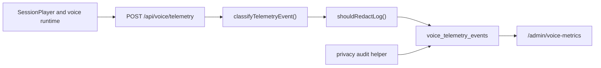

# Voice Telemetry and Observability

Purpose: Explain how PhysioBot measures voice quality, redacts sensitive payloads, and exposes operational metrics.

## Summary

Voice telemetry serves two different purposes:

- operational observability for the voice experience
- privacy-audit style logging for sensitive rehab data access

The runtime endpoint only accepts a small set of allowed event types. Separate internal code paths can also write class `D` audit events.

## Telemetry Flow

## Runtime Event Set

The public telemetry route currently accepts:

- `listen_started`
- `transcript_committed`
- `agent_reply_received`
- `audio_started`
- `interrupt`
- `fallback_mode`
- `turn_metrics`
- `voice_error`

## Current Rules

- event payloads are classified before insertion
- non-operational payloads are redacted before storage
- telemetry writes are best-effort in the client flow
- privacy-audit writes for class `D` events can be inserted directly by server helpers

## Admin View

The current admin page reads the last 7 days of `voice_telemetry_events` and derives:

- average turn time
- p95 turn time
- interrupt rate
- fallback rate
- error rate
- LLM timeout count
- direct-command count

The page also renders a recent-event table for debugging.

## Recommended Reader Mental Model

- `turn_metrics` is the main aggregated quality signal
- `voice_telemetry_events` is not just analytics data; it also carries privacy-audit significance
- redaction happens before storage, so the table is intentionally less detailed than the live runtime payloads

## Related Documents

- [Privacy and Data Handling](privacy-and-data-handling.md)
- [Voice Tool Execution](voice-tool-execution.md)
- [Voice Mode - Current Architecture](2026-03-10-voice-mode-current-architecture.md)
