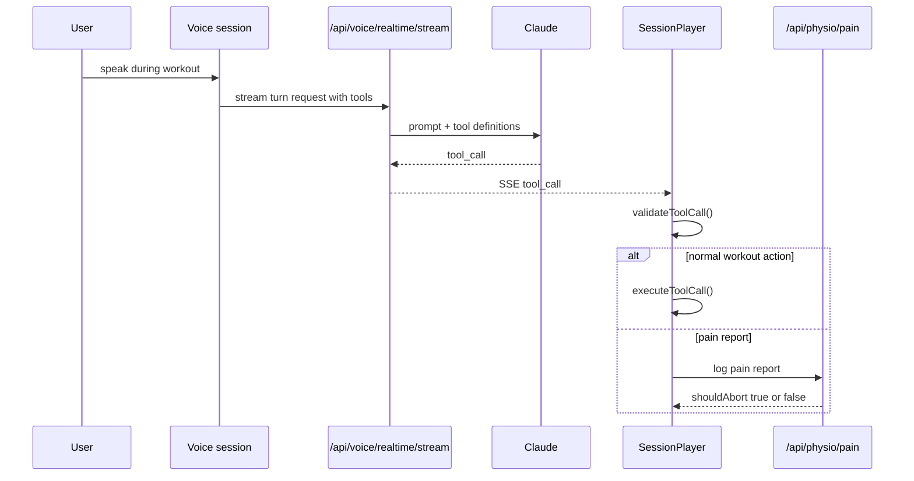

# Voice Tool Execution

Purpose: Explain how live voice turns can trigger workout actions and how those actions are validated and constrained.

## Summary

Voice tool execution is a multi-step chain:

1. the model receives the tool catalog
2. the streamed voice route forwards tool calls to the client
3. the session player validates tool use against workout state
4. approved actions update local workout state or call a dedicated API

## Tool Execution Flow

## Current Tool Catalog

- `next_exercise`
- `previous_exercise`
- `pause_workout`
- `resume_workout`
- `mark_set_complete`
- `adjust_timer`
- `log_pain`
- `end_session`

## Validation Layers

| Layer | Responsibility |
| --- | --- |
| model-side tool schema | defines what inputs are legal |
| sensitivity gate | blocks some tools when the turn is medically sensitive |
| workout-state validation | blocks illegal state transitions such as skipping ahead too early |
| specialized API handling | pain reports are persisted through a dedicated route |

## Current Safety Behavior

- `validateToolCall()` checks whether the requested action is valid for the current workout state
- high sensitivity can block tools before they reach client execution
- `log_pain` is treated specially and can end the session if the pain route returns `shouldAbort: true`
- the voice session can also auto-dispatch `pause_workout` after extended silence escalation

## Architecture Implication

Tool execution is not fully autonomous. The model can suggest actions, but the client still owns workout-state truth and the final application of those actions.

## Related Documents

- [Physio Mode and Safety](physio-mode-and-safety.md)
- [Voice Telemetry and Observability](voice-telemetry-and-observability.md)
- [Voice Mode - Current Architecture](2026-03-10-voice-mode-current-architecture.md)
- [ADR-0005 Mode-Based Voice Orchestration](../adr/ADR-0005-mode-based-voice-orchestration.md)
